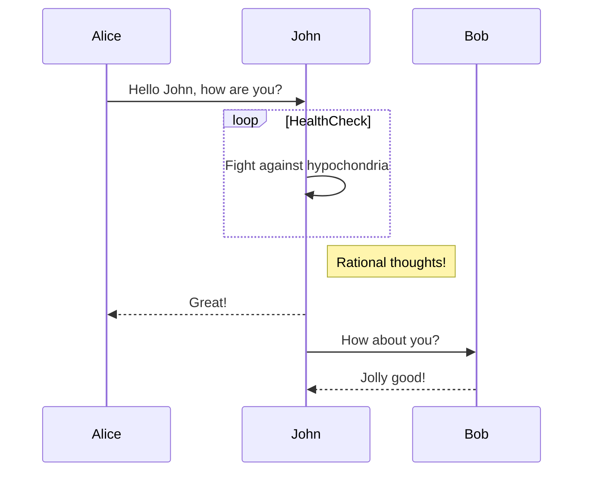

本文展示了 Hugo 内容文件中可用的基础 Markdown 语法示例。
<!--more-->

## 基础语法

### 标题

```
# 一级标题
## 二级标题
### 三级标题
#### 四级标题
##### 五级标题
###### 六级标题
```

## 二级标题
### 三级标题
#### 四级标题
##### 五级标题
###### 六级标题

### 强调

```text
*这段文字会显示为斜体*
_这段文字也会显示为斜体_

**这段文字会显示为粗体**
__这段文字也会显示为粗体__

_你可以**组合**使用_
```

*这段文字会显示为斜体*

_这段文字也会显示为斜体_

**这段文字会显示为粗体**

__这段文字也会显示为粗体__

_你可以**组合**使用_

### 列表

#### 无序列表

```
* 项目1
* 项目2
  * 子项目2a
  * 子项目2b
```

* 项目1
* 项目2
  * 子项目2a
  * 子项目2b

#### 有序列表

```
1. 项目1
2. 项目2
3. 项目3
   1. 子项目3a
   2. 子项目3b
```

### 图片

```markdown

```


### 链接

```markdown
[Hugo](https://gohugo.io)
```

[Hugo](https://gohugo.io)

### 引用块

```markdown
正如牛顿所说：

> 如果说我看得比别人更远些，那是因为我站在巨人的肩膀上。
```

> 如果说我看得比别人更远些，那是因为我站在巨人的肩膀上。

### 行内代码

```markdown
行内`代码`会用`反引号包裹`起来。
```

行内`代码`会用`反引号包裹`起来。

### 代码块

#### 语法高亮

````markdown
```go
func main() {
    fmt.Println("Hello World")
}
```
````

```go
func main() {
    fmt.Println("Hello World")
}
```

### 表格

```markdown
| 语法      | 描述         |
| --------- | ----------- |
| 标题      | 标题文本     |
| 段落      | 正文内容     |
```

| 语法      | 描述         |
| --------- | ----------- |
| 标题      | 标题文本     |
| 段落      | 正文内容     |


## 公式输入

$$F(\omega) = \int_{-\infty}^{\infty} f(t)\, e^{-j \omega t} \, dt$$

$$
\begin{aligned}
  \nabla \cdot \mathbf{E} &= \frac{\rho}{\varepsilon_0} \\
  \nabla \cdot \mathbf{B} &= 0 \\
  \nabla \times \mathbf{E} &= -\frac{\partial \mathbf{B}}{\partial t} \\
  \nabla \times \mathbf{B} &= \mu_0 \left( \mathbf{J} + \varepsilon_0 \frac{\partial \mathbf{E}}{\partial t} \right)
\end{aligned}
$$
$$\ce{Hg^2+ ->[I-] HgI2 ->[I-] [Hg^{II}I4]^2-}$$

## tab页面


  **JSON**: JavaScript Object Notation (JSON) is a standard text-based format for representing structured data based on JavaScript object syntax.
  **YAML**: YAML is a human-readable data serialization language.
  **TOML**: TOML aims to be a minimal configuration file format that's easy to read due to obvious semantics.




## Mermaid

## 参考资料

- [Markdown 语法](https://www.markdownguide.org/basic-syntax/)
- [Hugo Markdown](https://gohugo.io/content-management/formats/#markdown)


## emoji

:heart:

H1 `===`
===

H2 `---`
---

## line
`***` or `___`
***
___

## checkbox 

- [ ] 未完成任务
- [x] 已完成任务

## Blockquote

```markdown
> 这是一个引用块。
```

> 这是一个引用块。
